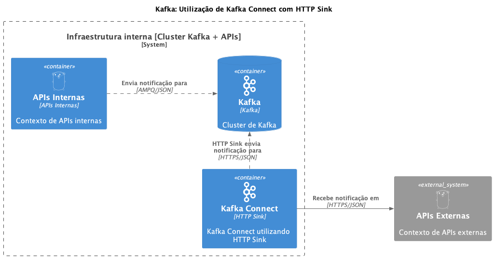

# Escopo
Criação de um Kafka Connect para enviar notificações com HTTP Sink

# Desenho da Solução
<p align="center">
  
</p>

# Executando com Docker
- Para executar o projeto local com docker, devemos utilizar os comandos
   ```
  make start
  ```
- Para parar a execução do projeto

  ```
  make stop
  ```